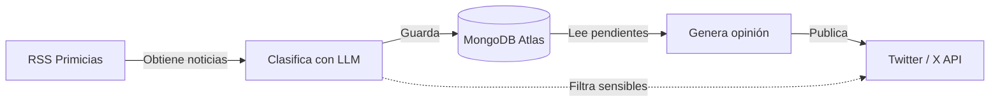

# Gopherec — Bot de noticias ecuatorianas con opinión

Gopherec es un bot automatizado que obtiene noticias del diario **Primicias**, las clasifica con **Gemini** (respaldado por **DeepSeek**), y genera opiniones críticas y sarcásticas en español ecuatoriano para publicarlas en **X** (Twitter).

## Cómo funciona



El bot se ejecuta cada **2 horas** y realiza el pipeline completo: obtener → clasificar → almacenar → opinar → publicar.

## Documentación

| Documento | Descripción |
|-----------|-------------|
| [Arquitectura](docs/01-arquitectura.md) | Cómo funciona el sistema por dentro: flujo de datos, decisiones de diseño, estados |
| [Guía de instalación](docs/02-guia-de-instalacion.md) | Paso a paso para configurar y ejecutar el bot |
| [Referencia técnica](docs/03-referencia.md) | Variables de entorno, modelos, interfaces y dependencias |
| [Planeación futura](docs/04-planeacion-futura.md) | Visión del proyecto: contexto histórico con búsqueda vectorial |

## Inicio rápido

```bash
git clone https://github.com/tuusuario/gopherec
cd gopherec
cp cmd/api/.env.example cmd/api/.env
# Editar cmd/api/.env con tus credenciales
docker compose up
```

## Requisitos

- Go 1.26+ (si ejecutas sin Docker)
- Docker y Docker Compose (opcional)
- Cuentas en: MongoDB Atlas, Google AI (Gemini), DeepSeek, X/Twitter Developer

## Licencia

MIT
