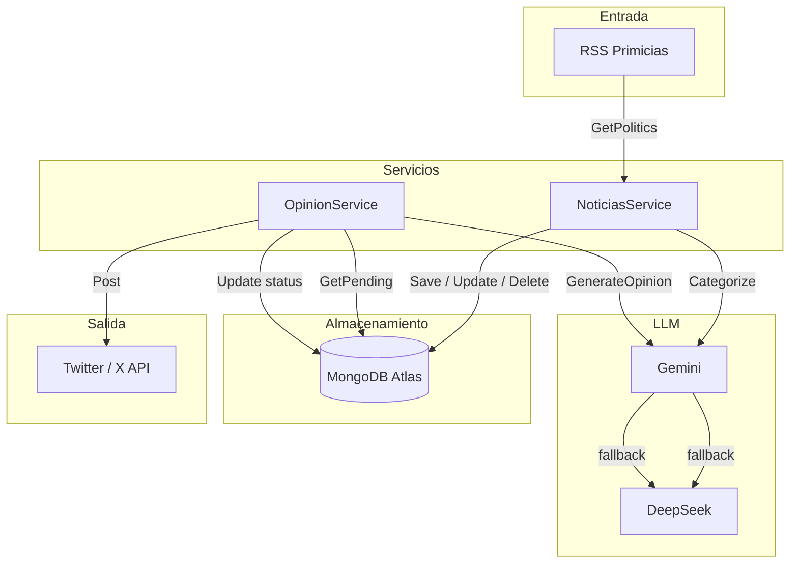
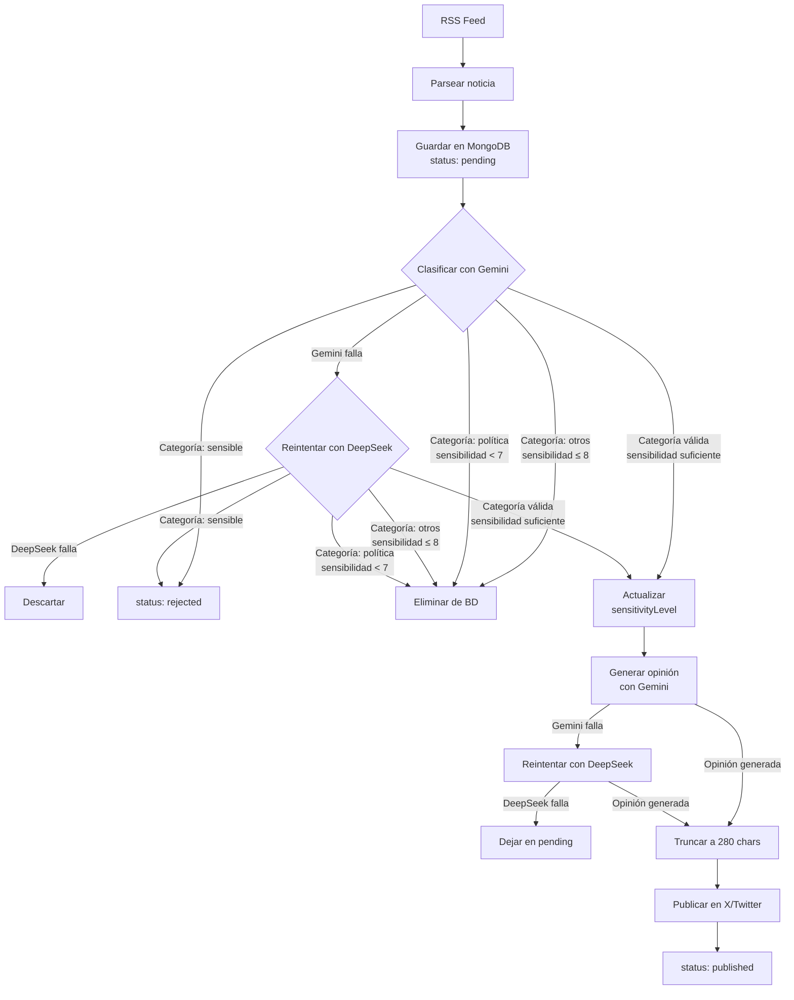
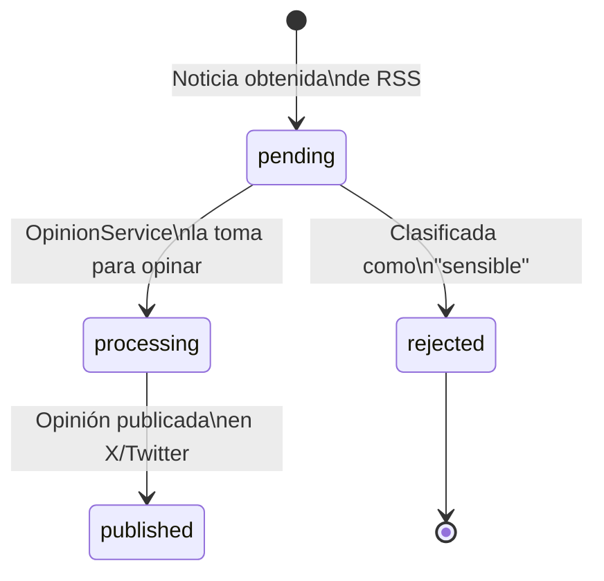

# Arquitectura

Este documento explica cómo funciona Gopherec por dentro: su diseño, flujo de datos, modelo de estados y las decisiones arquitectónicas principales.

## Vista general



## Pipeline de datos



## Decisiones de diseño

### Arquitectura hexagonal (Puertos y Adaptadores)

El código separa claramente el **dominio** (reglas de negocio) de los **adaptadores** (implementaciones concretas). Esto permite cambiar cualquier servicio externo sin afectar la lógica central.

```
internal/
├── domain/           # Interfaces y entidades del dominio
│   ├── entity/       # Structs de datos (Noticia, Clasificacion, Historia)
│   ├── llm.go        # Interfaz LLMProvider
│   ├── rss.go        # Interfaz RSS
│   ├── twitter.go    # Interfaz TwitterAPI
│   └── repositorio.go# Interfaz NoticiasRepo
├── platform/         # Adaptadores (implementaciones concretas)
│   ├── llm/gemini/   # Gemini como LLM primario
│   ├── llm/deepseek/ # DeepSeek como LLM secundario
│   ├── rss/          # Parser RSS (gofeed)
│   ├── twitter/      # Cliente X/Twitter (gotwi)
│   └── mongodb/      # Cliente MongoDB
├── service/          # Casos de uso (orquestación)
│   ├── noticias.go   # Obtener y clasificar noticias
│   └── opinion.go    # Generar opiniones y publicar
└── repository/       # Implementación del repositorio
    └── noticiasRepo.go
```

### Estrategia de respaldo (fallback)

Cada operación con LLM intenta **Gemini primero**. Si falla, se reintenta con **DeepSeek**. Esto aplica tanto para clasificación como para generación de opiniones.

- **Clasificación**: Gemini `gemini-2.5-flash` → DeepSeek `deepseek-chat`
- **Opinión**: Gemini `gemini-3-flash-preview` → DeepSeek `deepseek-chat`

### Ejecución programada

El bot corre en un bucle infinito con un `ticker` de **2 horas**. Al iniciar, ejecuta el pipeline inmediatamente y luego cada 2 horas.

## Estados de una noticia



| Estado | Significado |
|--------|-------------|
| `pending` | Noticia nueva, esperando ser procesada |
| `processing` | OpinionService está generando la opinión |
| `published` | Opinión publicada exitosamente en X |
| `rejected` | Noticia clasificada como sensible (no se publica) |

Además, las noticias categorizadas como `otros` con sensibilidad ≤ 8 o `política` con sensibilidad < 7 se **eliminan directamente** de la base de datos (no pasan por la máquina de estados).

## Modelo de datos

### Noticia

Representa una noticia obtenida de RSS, con su clasificación y estado de publicación.

| Campo | Tipo | Descripción |
|-------|------|-------------|
| `_id` | `ObjectID` | Identificador único |
| `title` | `string` | Título de la noticia |
| `description` | `string` | Resumen |
| `content` | `string` | Contenido completo (HTML limpiado) |
| `link` | `string` | URL original |
| `category` | `string` | Categoría asignada por el LLM |
| `status` | `string` | Estado actual (pending/rejected/processing/published) |
| `sensitivityLevel` | `int64` | Nivel de sensibilidad (1-10) |
| `published` | `time` | Fecha de publicación original |

### Clasificacion

Resultado devuelto por el LLM tras clasificar una noticia.

| Campo | Tipo | Descripción |
|-------|------|-------------|
| `category` | `Categoria` | `politica`, `economia`, `inseguridad`, `sensible`, `otros` |
| `sensitivityLevel` | `int64` | Nivel de sensibilidad del 1 al 10 |

### Historia (planeado)

Representa un hecho histórico ecuatoriano para búsqueda vectorial.

| Campo | Tipo | Descripción |
|-------|------|-------------|
| `_id` | `ObjectID` | Identificador único |
| `title` | `string` | Título del hecho histórico |
| `content` | `string` | Descripción detallada |
| `vectorContent` | `[]float64` | Embedding vectorial para búsqueda semántica |
| `category` | `Categoria` | Categoría relacionada |
| `year` | `int` | Año del suceso |
